# Context Engineering Pipeline for Research Assistant

A comprehensive research assistant that combines multiple AI agents using CrewAI Flows to provide intelligent, multi-source responses to research queries.

## 🚀 Quick Start

### Prerequisites Checklist

Before starting, ensure you have:

- [ ] **Python 3.10, 3.11, 3.12, or 3.13** installed (NOT Python 3.14)
- [ ] **Node.js 18+** installed
- [ ] **npm/yarn/pnpm** package manager
- [ ] **API keys** for required services (see below)
- [ ] **uv** package manager (optional, but recommended)

**⚠️ Critical:** Python 3.14 is NOT supported. If you have Python 3.14, you must use Python 3.13 or lower. See the troubleshooting section below for help.

### Required API Keys

You'll need API keys from these services:
- [Tensorlake](https://tensorlake.ai/) - Document parsing
- [Voyage AI](https://dashboard.voyageai.com/) - Embeddings
- [Zep AI](https://www.getzep.com/) - Memory layer
- [Firecrawl](https://www.firecrawl.dev/) - Web search
- [OpenAI](https://openai.com) or [OpenRouter](https://openrouter.ai/) - LLM

### Quick Setup (5 minutes)

**Step 1: Install Backend Dependencies**
**With uv:**
```bash
cd backend
uv sync --python 3.12
# Or
uv sync --python 3.13
```

**With pip/venv:**
```bash
cd backend
# Windows
py -3.12 -m venv .venv
# Or
py -3.13 -m venv .venv

# Linux/Mac
python3.12 -m venv .venv
# Or
python3.13 -m venv .venv
```

**Step 2: Install Frontend Dependencies**
```bash
cd frontend
npm install
cd ..
```

**Step 3: Configure Environment**
```bash
# Copy example files
cd backend
cp .env.example .env
cd ../frontend
cp .env.example .env.local
cd ..

# Edit backend/.env with your API keys
# The frontend/.env.local already has correct port settings
# Note: .env file is in backend/ directory
```

**Step 4: Start Backend (Terminal 1)**
```bash
.venv\Scripts\activate  # Activate venv
cd backend
python api_server.py
```
✅ Backend runs on: `http://localhost:8003`

**Step 5: Start Frontend (Terminal 2)**
```bash
cd frontend
npm run dev
```
✅ Frontend runs on: `http://localhost:3003`

**Step 6: Open Browser**
- Navigate to `http://localhost:3003`
- Click "Initialize Assistant"
- Upload a PDF document
- Start asking questions!

**📖 For detailed step-by-step instructions, see [How to Start the Project](#how-to-start-the-project) section below.**

## Architecture Overview

This research assistant uses a multi-agent CrewAI Flow architecture with the following components:

### Core Components

1. **Document Processing & RAG Pipeline**
   - TensorLake for complex document parsing with structured extraction
   - Voyage Context 3 embeddings for contextualized semantic understanding
   - Qdrant vector database (embedded mode) for efficient similarity search
   - OpenAI GPT models with structured output formatting

2. **Memory Layer**
   - Zep Cloud for persistent conversation memory
   - User preference tracking
   - Conversation summarization and context retrieval

3. **Web Search Integration**
   - Firecrawl for real-time web search capabilities
   - Retrieval of recent information not available in documents

4. **Multi-Agent Flow Architecture**
   - **RAG Agent**: Searches through parsed research documents
   - **Memory Agent**: Retrieves conversation history and user preferences
   - **Web Search Agent**: Finds recent web-based information
   - **Tool Calling Agent**: Interfaces with external APIs (extensible)
   - **Evaluator Agent**: Filters and ranks context relevance
   - **Synthesizer Agent**: Creates coherent final responses

## Flow Process

```mermaid
graph TD
    A["User Query"] --> B["ResearchAssistantFlow<br/>Entry Point"]
    B --> C["Parallel Agent Execution"]
    
    C --> D["RAG Agent<br/>📚 Document Search"]
    C --> E["Memory Agent<br/>🧠 Context Retrieval"]
    C --> F["Web Search Agent<br/>🌐 Real-time Info"]
    C --> G["Tool Calling Agent<br/>🔧 External APIs"]
    
    D --> H["Context Collection<br/>📊 Aggregate Results"]
    E --> H
    F --> H
    G --> H
    
    H --> I["Evaluator Agent<br/>🎯 Filter Relevance"]
    I --> J["Synthesizer Agent<br/>✍️ Generate Response"]
    J --> K["Final Response<br/>📝 Coherent Answer"]
    
    subgraph "RAG Pipeline Components"
        D1["TensorLake<br/>Document Parser"] --> D2["Voyage Context 3<br/>Embeddings"]
        D2 --> D3["Qdrant Vector DB<br/>Similarity Search"]
        D3 --> D
    end
    
    subgraph "Memory Components"
        E1["Zep Cloud<br/>Conversation History"] --> E
        E2["User Preferences<br/>Context Summaries"] --> E
    end
    
    subgraph "Generation"
        J1["OpenAI GPT<br/>Structured Output"] --> J
        J2["Citation Management<br/>Confidence Scoring"] --> J
    end
    
    style A fill:#e1f5fe
    style K fill:#e8f5e8
    style I fill:#fff3e0
    style J fill:#f3e5f5
```



## Project Structure

```
context-engineering-workflow/
├── 📁 backend/                     # 🔧 Backend code directory
│   ├── 📄 api_server.py            # 🚀 FastAPI backend server
│   ├── 📁 src/                     # Main source code directory
│   │   ├── 📁 workflows/           # 🎯 Complete workflow orchestration
│   │   │   ├── 📄 agents.py        # Agent creation from YAML configs
│   │   │   ├── 📄 tasks.py         # Task creation from YAML configs  
│   │   │   └── 📄 flow.py          # Main ResearchAssistantFlow
│   │   ├── 📁 tools/               # 🔧 All specialized tools
│   │   │   ├── 📄 rag_tool.py      # RAG search functionality
│   │   │   ├── 📄 memory_tool.py   # Memory retrieval tool
│   │   │   ├── 📄 arxiv_tool.py    # ArXiv academic search
│   │   │   └── 📄 web_search_tool.py # Web search via Firecrawl
│   │   ├── 📁 rag/                 # 📚 RAG pipeline components
│   │   │   ├── 📄 rag_pipeline.py  # Unified RAG orchestration
│   │   │   ├── 📄 retriever.py     # Qdrant vector database
│   │   │   └── 📄 embeddings.py    # Contextualized embeddings
│   │   ├── 📁 document_processing/ # 📄 Document parsing & processing
│   │   │   └── 📄 doc_parser.py    # TensorLake document parser
│   │   ├── 📁 memory/              # 🧠 Memory management
│   │   │   └── 📄 memory.py        # Zep memory layer
│   │   ├── 📁 generation/           # ✍️ Response generation
│   │   │   └── 📄 generation.py    # Structured response generation
│   │   └── 📁 config/              # ⚙️ Configuration management
│   │       └── 📄 config_loader.py # YAML configuration loader
│   ├── 📁 config/                  # 📋 YAML configuration files
│   │   ├── 📁 agents/              # Agent configurations
│   │   │   └── 📄 research_agents.yaml # Agent roles, goals, backstories
│   │   └── 📁 tasks/               # Task configurations  
│   │       └── 📄 research_tasks.yaml # Task descriptions, expected outputs
│   ├── 📄 pyproject.toml           # Python dependencies
│   ├── 📄 uv.lock                  # Dependency lock file
│   └── 📄 .env.example              # Environment variables template
├── 📁 backend/                     # 🔧 Backend code directory
│   ├── 📁 data/                    # 📊 Research documents (PDFs)
│   ├── 📁 outputs/                 # 📤 Generated outputs and results
│   └── 📁 qdrant_db/               # 🗄️ Qdrant vector database (embedded)
├── 📁 frontend/                    # ⚛️ React Next.js frontend
│   ├── 📁 app/                     # Next.js app directory
│   ├── 📁 components/              # React components
│   └── 📁 lib/                     # Utilities and API client
└── 📄 README.md                    
```

## Installation & Setup

### Prerequisites

- Python 3.13+ (or Python 3.9+)
- Node.js 18+ and npm/yarn/pnpm
- `uv` package manager (recommended) or pip

### Step 1: Install Backend Dependencies

#### Option A: Using `uv` (Recommended)

1. **Install `uv` package manager:**
   ```bash
   # MacOS/Linux
   curl -LsSf https://astral.sh/uv/install.sh | sh

   # Windows
   powershell -ExecutionPolicy ByPass -c "irm https://astral.sh/uv/install.ps1 | iex"
   ```

2. **Install Python dependencies:**
   ```bash
   # Navigate to backend directory
   cd backend
   
   # Install all dependencies
   uv sync

   # Activate virtual environment
   source .venv/bin/activate  # MacOS/Linux
   .venv\Scripts\activate     # Windows
   ```

#### Option B: Using pip

```bash
# Navigate to backend directory
cd backend

# Create virtual environment
python -m venv .venv

# Activate virtual environment
source .venv/bin/activate  # MacOS/Linux
.venv\Scripts\activate     # Windows

# Install dependencies
pip install -e .
```

### Step 2: Install Frontend Dependencies

```bash
cd frontend
npm install
# or
yarn install
# or
pnpm install
```

### Step 3: Set Up Environment Variables

Create a `.env` file in the `backend/` directory with your API keys:

```env
# LLM Provider (choose one)
OPENAI_API_KEY=your_openai_key
# OR use OpenRouter (supports multiple LLM providers)
OPENROUTER_API_KEY=your_openrouter_key

# Required Services
TENSORLAKE_API_KEY=your_tensorlake_key
VOYAGE_API_KEY=your_voyage_key
ZEP_API_KEY=your_zep_key
FIRECRAWL_API_KEY=your_firecrawl_key

# Optional Configuration
QDRANT_DB_PATH=./qdrant_db  # Now in backend/ folder
API_PORT=8003
FRONTEND_PORT=3003
```

**Get your API keys:**
- [Tensorlake →](https://tensorlake.ai/) - Document parsing
- [Voyage AI →](https://dashboard.voyageai.com/) - Embeddings
- [Zep AI →](https://www.getzep.com/) - Memory layer
- [Firecrawl →](https://www.firecrawl.dev/) - Web search
- [OpenAI →](https://openai.com) or [OpenRouter →](https://openrouter.ai/) - LLM

**Note:** You can use either `OPENAI_API_KEY` or `OPENROUTER_API_KEY`. If both are provided, OpenRouter will be used. OpenRouter provides access to multiple LLM providers (OpenAI, Anthropic, Google, etc.) through a unified API.

### Step 4: Configure Frontend Environment

1. **Copy the example environment file:**
   ```bash
   cp frontend/.env.example frontend/.env.local
   ```

2. **Edit `frontend/.env.local`** if needed (defaults are already set):

```env
NEXT_PUBLIC_API_URL=http://localhost:8003
PORT=3003
```

**Note:** The backend port (8003) is configurable via `API_PORT` in the `backend/.env` file. The frontend port (3003) is configurable via `PORT` in `frontend/.env.local` or `FRONTEND_PORT` in `backend/.env`.

### Step 5: Prepare Documents (Optional)

Place your research documents (PDF format) in the `backend/data/` directory. You can also upload documents through the web interface.

## 🚀 How to Start the Project - Complete Step-by-Step Guide

Follow these steps **in order** to get the project running. Each step must be completed before moving to the next.

### 📋 Quick Startup Checklist

- [ ] **Step 1:** Verify Python version (3.10-3.13, NOT 3.14)
- [ ] **Step 2:** Set up backend environment (venv, dependencies, .env)
- [ ] **Step 3:** Set up frontend environment (npm install, .env.local)
- [ ] **Step 4:** Start backend server (Terminal 1)
- [ ] **Step 5:** Start frontend server (Terminal 2)
- [ ] **Step 6:** Access application in browser
- [ ] **Step 7:** Verify everything is working

---

## 📖 Detailed Step-by-Step Instructions

### Step 1: Verify Prerequisites

#### 1.1 Check Python Version

**⚠️ Critical:** This project requires Python 3.10, 3.11, 3.12, or 3.13. **Python 3.14 is NOT supported.**

```bash
python --version
```

**Expected output:** `Python 3.13.x` or `Python 3.12.x` or `Python 3.11.x` or `Python 3.10.x`

**If you have Python 3.14:**
1. Download Python 3.13 from: https://www.python.org/downloads/release/python-3130/
2. Install it (you can have multiple Python versions installed)
3. Use `py -3.13` to specify Python 3.13 when creating the virtual environment

#### 1.2 Check Node.js Version

```bash
node --version
```

**Expected output:** `v18.x.x` or higher

**If Node.js is not installed:**
- Download from: https://nodejs.org/
- Install the LTS version

#### 1.3 Install `uv` Package Manager (Optional but Recommended)

**Windows:**
```powershell
powershell -ExecutionPolicy ByPass -c "irm https://astral.sh/uv/install.ps1 | iex"
```

**MacOS/Linux:**
```bash
curl -LsSf https://astral.sh/uv/install.sh | sh
```

**Verify installation:**
```bash
uv --version
```

---

### Step 2: Set Up Backend Environment

#### 2.1 Navigate to Backend Directory

```bash
cd context-engineering-workflow/backend
```

#### 2.2 Create Virtual Environment

**Option A: Using `uv` (Recommended)**
```bash
uv venv
```

**Option B: Using Python directly**
```bash
python -m venv .venv
# Or with Python 3.13 specifically:
py -3.13 -m venv .venv
```

#### 2.3 Activate Virtual Environment

**Windows (PowerShell):**
```powershell
.venv\Scripts\Activate.ps1
```

**Windows (CMD):**
```cmd
.venv\Scripts\activate.bat
```

**MacOS/Linux:**
```bash
source .venv/bin/activate
```

**✅ Verify activation:** You should see `(.venv)` in your terminal prompt.

#### 2.4 Verify Python Version in Virtual Environment

```bash
python --version
```

**Expected output:** `Python 3.13.x` or `Python 3.12.x` or `Python 3.11.x` or `Python 3.10.x` (NOT 3.14)

#### 2.5 Install Backend Dependencies

**Option A: Using `uv` (Recommended)**
```bash
uv sync
```

**Option B: Using pip**
```bash
pip install -e .
```

**✅ Expected output:** Dependencies will be installed. This may take a few minutes.

#### 2.6 Set Up Backend Environment Variables

```bash
# Copy the example environment file
cp .env.example .env
```

**Edit `backend/.env` file with your actual API keys:**

```env
# LLM Provider (choose one)
OPENAI_API_KEY=your_openai_key_here
# OR use OpenRouter (supports multiple LLM providers)
OPENROUTER_API_KEY=your_openrouter_key_here

# Required Services
TENSORLAKE_API_KEY=your_tensorlake_key_here
VOYAGE_API_KEY=your_voyage_key_here
ZEP_API_KEY=your_zep_key_here
FIRECRAWL_API_KEY=your_firecrawl_key_here

# Server Configuration
API_PORT=8003
FRONTEND_PORT=3003

# Optional Configuration
QDRANT_DB_PATH=./qdrant_db
```

**🔑 Get your API keys:**
- [Tensorlake](https://tensorlake.ai/) - Document parsing
- [Voyage AI](https://dashboard.voyageai.com/) - Embeddings
- [Zep AI](https://www.getzep.com/) - Memory layer
- [Firecrawl](https://www.firecrawl.dev/) - Web search
- [OpenAI](https://openai.com) or [OpenRouter](https://openrouter.ai/) - LLM

**Note:** You can use either `OPENAI_API_KEY` or `OPENROUTER_API_KEY`. If both are provided, OpenRouter will be used.

---

### Step 3: Set Up Frontend Environment

#### 3.1 Navigate to Frontend Directory

```bash
cd ../frontend
```

#### 3.2 Install Frontend Dependencies

```bash
npm install
# or
yarn install
# or
pnpm install
```

**✅ Expected output:** Dependencies will be installed. This may take a few minutes.

#### 3.3 Set Up Frontend Environment Variables

```bash
# Copy the example environment file
cp .env.example .env.local
```

**The `frontend/.env.local` file should contain:**

```env
# Backend API URL
NEXT_PUBLIC_API_URL=http://localhost:8003

# Frontend Port
PORT=3003
```

**Note:** These values are already correct by default. You only need to edit if you changed the backend port.

---

### Step 4: Start the Backend Server

**Open Terminal 1 (or Command Prompt/PowerShell):**

#### 4.1 Navigate to Backend Directory

```bash
cd context-engineering-workflow/backend
```

#### 4.2 Activate Virtual Environment

**Windows (PowerShell):**
```powershell
.venv\Scripts\Activate.ps1
```

**Windows (CMD):**
```cmd
.venv\Scripts\activate.bat
```

**MacOS/Linux:**
```bash
source .venv/bin/activate
```

**✅ Verify:** You should see `(.venv)` in your terminal prompt.

#### 4.3 Start the FastAPI Server

```bash
python api_server.py
```

**✅ Expected output:**
```
INFO:     Started server process [xxxxx]
INFO:     Waiting for application startup.
INFO:     Application startup complete.
INFO:     Uvicorn running on http://0.0.0.0:8003 (Press CTRL+C to quit)
```

**✅ Backend is now running on:** `http://localhost:8003`

**⚠️ Important:** 
- Keep this terminal window open
- Do NOT close this terminal while the backend is running
- If you see errors, check that:
  - Virtual environment is activated (`(.venv)` in prompt)
  - Python version is correct (not 3.14)
  - All API keys are set in `backend/.env`

---

### Step 5: Start the Frontend Server

**Open Terminal 2 (a NEW terminal window):**

#### 5.1 Navigate to Frontend Directory

```bash
cd context-engineering-workflow/frontend
```

#### 5.2 Start the Next.js Development Server

```bash
npm run dev
# or
yarn dev
# or
pnpm dev
```

**✅ Expected output:**
```
  ▲ Next.js 14.x.x
  - Local:        http://localhost:3003
  - ready started server on 0.0.0.0:3003
```

**✅ Frontend is now running on:** `http://localhost:3003`

**⚠️ Important:**
- Keep this terminal window open
- Do NOT close this terminal while the frontend is running
- The frontend will automatically reload when you make code changes

---

### Step 6: Access the Application

#### 6.1 Open Your Browser

Navigate to: **http://localhost:3003**

#### 6.2 Initialize the Assistant

1. Click the **"Initialize Assistant"** button on the landing page
2. Wait for the initialization to complete (you should see a success message)

#### 6.3 Upload a Document (Optional)

1. Click **"Upload Document"** or drag and drop a PDF file
2. Wait for the upload to complete
3. The document will be processed and indexed

#### 6.4 Start Asking Questions

1. Type your research question in the chat input
2. Press Enter or click Send
3. The assistant will process your query and provide a response with citations

---

### Step 7: Verify Everything is Working

#### 7.1 Check Backend Health

Open in browser: **http://localhost:8003/health**

**Expected response:**
```json
{
  "status": "healthy",
  "timestamp": "2025-01-XX..."
}
```

#### 7.2 Check Backend API Documentation

Open in browser: **http://localhost:8003/docs**

You should see the Swagger UI with all available API endpoints.

#### 7.3 Test the Frontend

1. Frontend loads at `http://localhost:3003` ✅
2. Can click "Initialize Assistant" ✅
3. Can upload a document ✅
4. Can send a query and receive a response ✅

---

## 🛑 How to Stop the Project

### Stop Backend Server

In **Terminal 1**, press:
```
CTRL + C
```

### Stop Frontend Server

In **Terminal 2**, press:
```
CTRL + C
```

---

## 🔄 Quick Restart Instructions

Once everything is set up, you can quickly restart the project:

### Restart Backend

```bash
cd backend
.venv\Scripts\activate  # Windows
# or
source .venv/bin/activate  # MacOS/Linux
python api_server.py
```

### Restart Frontend

```bash
cd frontend
npm run dev
```

---

## 📝 Summary

After completing all steps:

- ✅ Backend running on: `http://localhost:8003`
- ✅ Frontend running on: `http://localhost:3003`
- ✅ Application accessible at: `http://localhost:3003`
- ✅ API documentation at: `http://localhost:8003/docs`
- ✅ Health check at: `http://localhost:8003/health`

---

### Detailed Steps (Legacy Section)

### Step 1: Verify Python Version

**⚠️ Critical:** This project requires Python 3.10, 3.11, 3.12, or 3.13. Python 3.14 is NOT supported.

```bash
python --version
```

**If you have Python 3.14:**
- You need to install Python 3.13
- Download from: https://www.python.org/downloads/release/python-3130/
- Navigate to backend: `cd backend`
- Create venv with: `py -3.13 -m venv .venv` or `C:\Users\Dell\AppData\Local\Programs\Python\Python313\python.exe -m venv .venv`
- Activate and verify: `.venv\Scripts\activate` then `python --version`

### Step 2: Set Up Backend Environment

1. **Navigate to backend directory:**
   ```bash
   cd context-engineering-workflow/backend
   ```

2. **Create virtual environment (if not exists):**
   ```bash
   # Using uv (recommended)
   uv venv
   
   # OR using Python directly
   python -m venv .venv
   # Or with Python 3.13 specifically:
   py -3.13 -m venv .venv
   ```

3. **Activate virtual environment:**
   ```bash
   # Windows (PowerShell)
   .venv\Scripts\activate
   
   # Windows (CMD)
   .venv\Scripts\activate.bat
   
   # MacOS/Linux
   source .venv/bin/activate
   ```

4. **Verify Python version in virtual environment:**
   ```bash
   python --version  # Should show 3.10, 3.11, 3.12, or 3.13
   ```

5. **Install backend dependencies:**
   ```bash
   cd backend
   # Using uv (recommended)
   uv sync
   
   # OR using pip
   pip install -e .
   cd ..
   ```

6. **Set up environment variables:**
   ```bash
   cd backend
   # Copy example environment file
   cp .env.example .env
   
   # Edit .env with your actual API keys
   # Required keys:
   # - TENSORLAKE_API_KEY
   # - VOYAGE_API_KEY
   # - ZEP_API_KEY
   # - FIRECRAWL_API_KEY
   # - OPENAI_API_KEY or OPENROUTER_API_KEY
   ```

### Step 3: Set Up Frontend Environment

1. **Navigate to frontend directory:**
   ```bash
   cd frontend
   ```

2. **Install frontend dependencies:**
   ```bash
   npm install
   # or
   yarn install
   # or
   pnpm install
   ```

3. **Set up frontend environment variables:**
   ```bash
   # Copy example environment file
   cp .env.example .env.local
   
   # The .env.local file should contain:
   # NEXT_PUBLIC_API_URL=http://localhost:8003
   # PORT=3003
   ```

4. **Go back to project root:**
   ```bash
   cd ..
   ```

### Step 4: Start the Backend Server

**Open Terminal 1 (or Command Prompt/PowerShell):**

1. **Navigate to project root:**
   ```powershell
   cd C:\Users\Dell\myproject\ai-engineering\advanced\context-engineering-workflow
   ```

2. **Activate virtual environment:**
   ```powershell
   # Navigate to backend first
   cd backend
   
   # Windows PowerShell
   .\.venv\Scripts\Activate.ps1
   
   # Windows CMD
   .venv\Scripts\activate.bat
   
   # MacOS/Linux
   source .venv/bin/activate
   ```
   
   **⚠️ IMPORTANT:** You MUST activate the virtual environment first! 
   - You should see `(.venv)` in your terminal prompt
   - Verify Python version: `python --version` should show 3.13.x (NOT 3.14)

3. **Start the FastAPI server:**
   
   **Manual activation:**
   ```bash
   # Navigate to backend directory
   cd backend
   
   # Activate virtual environment
   .venv\Scripts\activate  # Windows PowerShell
   .venv\Scripts\activate.bat  # Windows CMD
   source .venv/bin/activate  # MacOS/Linux
   
   # Start the server
   python api_server.py
   ```

   **Expected output:**
   ```
   INFO:     Started server process [xxxxx]
   INFO:     Waiting for application startup.
   INFO:     Application startup complete.
   INFO:     Uvicorn running on http://0.0.0.0:8003 (Press CTRL+C to quit)
   ```
   
   **⚠️ Important:** Always activate the virtual environment and navigate to the `backend/` directory before running `python api_server.py`. If you see Python 3.14 errors, you're not using the virtual environment.

4. **Verify backend is running:**
   - Open `http://localhost:8003/docs` in your browser - You should see Swagger UI
   - Open `http://localhost:8003/health` - Should return `{"status": "healthy"}`

**Keep this terminal open** - the backend server must stay running.

### Step 5: Start the Frontend Server

**Open Terminal 2 (a new terminal window):**

1. **Navigate to frontend directory:**
   ```bash
   cd path\to\context-engineering-workflow\frontend
   ```

2. **Start the Next.js development server:**
   ```bash
   npm run dev
   ```

   **Expected output:**
   ```
   ▲ Next.js 14.2.0
   - Local:        http://localhost:3003
   - Ready in 2.3s
   ```

3. **Verify frontend is running:**
   - The terminal should show "Ready" message
   - No error messages should appear

**Keep this terminal open** - the frontend server must stay running.

### Step 6: Access the Application

1. **Open your web browser** and navigate to:
   ```
   http://localhost:3003
   ```

2. **Initialize the Assistant:**
   - Look at the left sidebar
   - Click the **"Initialize Assistant"** button
   - Wait for the status to change to "Online" (green checkmark)

3. **Upload a Document:**
   - In the left sidebar, find the "Document Processing" section
   - Click "Select File" or drag and drop a PDF file
   - Click "Process" button
   - Wait for processing to complete (may take 1-2 minutes)
   - You should see "✅ Document Ready" message

4. **Start Using the Assistant:**
   - Once the document is processed, you can start asking questions
   - Type your question in the chat input at the bottom
   - Press Enter or click the Send button
   - Wait for the AI to process and respond

### Step 7: Verify Everything is Working

**Check Backend:**
- ✅ Terminal 1 shows "Uvicorn running on http://0.0.0.0:8003"
- ✅ `http://localhost:8003/docs` shows Swagger UI
- ✅ `http://localhost:8003/health` returns healthy status

**Check Frontend:**
- ✅ Terminal 2 shows "Ready" message
- ✅ `http://localhost:3003` loads without errors
- ✅ No "Network Error" messages in the browser

**Check Application:**
- ✅ Assistant status shows "Online" after initialization
- ✅ Document upload and processing works
- ✅ Chat interface is functional

## Quick Start Summary

For experienced users, here's the quick version:

```bash
# Terminal 1 - Backend
cd context-engineering-workflow/backend
.venv\Scripts\activate  # Windows
python api_server.py

# Terminal 2 - Frontend  
cd context-engineering-workflow\frontend
npm run dev
```

Then open `http://localhost:3003` in your browser.

### API Documentation

Once the backend is running, you can access:
- **Swagger UI**: `http://localhost:8003/docs` - Interactive API documentation with try-it-out feature
- **ReDoc**: `http://localhost:8003/redoc` - Alternative API documentation format
- **Health Check**: `http://localhost:8003/health` - Service health status endpoint

**Note:** The port is configurable via `API_PORT` environment variable (default: 8003)

### Development Mode

Both servers run in development mode with auto-reload:
- **Backend**: Changes to Python files will automatically restart the server
- **Frontend**: Changes to React/TypeScript files will hot-reload in the browser (no page refresh needed)

### Production Build

To build for production:

**Backend:**
```bash
cd backend
# No build needed, just run with uvicorn (uses API_PORT from .env)
uvicorn api_server:app --host 0.0.0.0 --port 8003
# Or let it read from environment:
python api_server.py
```

**Frontend:**
```bash
cd frontend
npm run build
npm start
```

## Project Structure

```
context-engineering-workflow/
├── 📁 backend/                     # 🔧 Backend code directory
│   ├── 📄 api_server.py            # 🚀 FastAPI backend server
│   ├── 📁 src/                     # Main source code directory
│   │   ├── 📁 workflows/           # 🎯 Complete workflow orchestration
│   │   │   ├── 📄 agents.py        # Agent creation from YAML configs
│   │   │   ├── 📄 tasks.py         # Task creation from YAML configs  
│   │   │   └── 📄 flow.py          # Main ResearchAssistantFlow
│   │   ├── 📁 tools/               # 🔧 All specialized tools
│   │   │   ├── 📄 rag_tool.py      # RAG search functionality
│   │   │   ├── 📄 memory_tool.py   # Memory retrieval tool
│   │   │   ├── 📄 arxiv_tool.py    # ArXiv academic search
│   │   │   └── 📄 web_search_tool.py # Web search via Firecrawl
│   │   ├── 📁 rag/                 # 📚 RAG pipeline components
│   │   │   ├── 📄 rag_pipeline.py  # Unified RAG orchestration
│   │   │   ├── 📄 retriever.py     # Qdrant vector database
│   │   │   └── 📄 embeddings.py    # Contextualized embeddings
│   │   ├── 📁 document_processing/ # 📄 Document parsing & processing
│   │   │   └── 📄 doc_parser.py    # TensorLake document parser
│   │   ├── 📁 memory/              # 🧠 Memory management
│   │   │   └── 📄 memory.py        # Zep memory layer
│   │   ├── 📁 generation/           # ✍️ Response generation
│   │   │   └── 📄 generation.py    # Structured response generation
│   │   └── 📁 config/              # ⚙️ Configuration management
│   │       └── 📄 config_loader.py # YAML configuration loader
│   ├── 📁 config/                  # 📋 YAML configuration files
│   │   ├── 📁 agents/              # Agent configurations
│   │   │   └── 📄 research_agents.yaml # Agent roles, goals, backstories
│   │   └── 📁 tasks/               # Task configurations  
│   │       └── 📄 research_tasks.yaml # Task descriptions, expected outputs
│   ├── 📄 pyproject.toml           # Python dependencies
│   ├── 📄 uv.lock                  # Dependency lock file
│   └── 📄 .env.example              # Environment variables template
├── 📁 backend/                     # 🔧 Backend code directory
│   ├── 📁 data/                    # 📊 Research documents (PDFs)
│   ├── 📁 outputs/                 # 📤 Generated outputs and results
│   └── 📁 qdrant_db/               # 🗄️ Qdrant vector database (embedded)
├── 📁 frontend/                    # ⚛️ React Next.js frontend
│   ├── 📁 app/                     # Next.js app directory
│   ├── 📁 components/              # React components
│   └── 📁 lib/                     # Utilities and API client
└── 📄 README.md
```

## Troubleshooting

### Backend Issues

**Port already in use:**
```bash
# Change port in .env file
API_PORT=8004

# Or specify port directly
uvicorn api_server:app --reload --port 8004
```

**Qdrant database locked:**
- Stop all running instances of the application
- Wait a few seconds
- Restart the backend server

**Missing API keys:**
- Ensure all required API keys are set in `.env` file
- Check that `.env` file is in the project root directory
- Restart the backend server after adding keys

### Frontend Issues

**Cannot connect to backend:**
- Verify backend is running on `http://localhost:8003` (or your configured `API_PORT`)
- Check `NEXT_PUBLIC_API_URL` in `frontend/.env.local` matches your backend URL
- Check browser console for CORS errors
- Ensure `API_PORT` in root `.env` matches the port in `NEXT_PUBLIC_API_URL`

**Module not found errors:**
```bash
cd frontend
rm -rf node_modules package-lock.json
npm install
```

**Port 3003 already in use:**
```bash
# Change PORT in frontend/.env.local
PORT=3004

# Or specify port directly
npm run dev -- -p 3004
```

### Common Issues

**Import errors:**
- Ensure virtual environment is activated
- Reinstall dependencies: `uv sync` or `pip install -e .`
- **Python version issue:** If you see Pydantic V1 errors, you're likely using Python 3.14. Switch to Python 3.13 or lower.
- **ModuleNotFoundError:** Make sure all dependencies are installed: `uv sync` or `pip install -e .`

**Backend won't start:**
- Check Python version: `python --version` (must be 3.10-3.13)
- Verify virtual environment is activated
- Check for missing API keys in `.env` file
- Review error messages in terminal for specific issues
- **Python version issue:** If you see Pydantic V1 errors, you're likely using Python 3.14. Switch to Python 3.13 or lower. Create a new venv with Python 3.13.

**Document upload fails:**
- Check file is valid PDF format
- Ensure file size is under 50MB
- Verify TensorLake API key is correct

**Query processing fails:**
- Ensure document is uploaded and processed first
- Check all API keys are valid
- Review backend logs for detailed error messages

## Key Features

### 1. Extended citations support
Each response includes comprehensive source attribution with a:

#### 🎯 Source Relevance Summary
- **Relevant Sources**: List of sources used
- **Relevance Scores**: Confidence scores (0-1) for each source
- **Reasoning**: Explanation of source selection

### 2. Multi-Source Intelligence
- Combines document knowledge, conversation memory, web search, and external APIs
- Each source operates independently and in parallel for efficiency

### 3. Intelligent Context Evaluation
- Evaluator agent filters irrelevant information
- Only relevant context is used for final response generation

### 4. Coherent Response Synthesis
- Synthesizer agent creates well-structured responses
- Proper citation and confidence scoring
- Handles insufficient context gracefully

### 5. Persistent Memory
- Conversation history stored in Zep Cloud
- User preferences and context maintained across sessions
- Agentic memory with graph-based internal representations

## API Requirements

- **TensorLake**: Document parsing and structured extraction
- **Voyage AI**: Contextualized embeddings
- **OpenAI** or **OpenRouter**: Response generation with structured outputs
  - OpenRouter is an alternative that provides access to multiple LLM providers (OpenAI, Anthropic, Google, etc.)
- **Zep Cloud**: Persistent memory and conversation management
- **Firecrawl**: Web search capabilities

